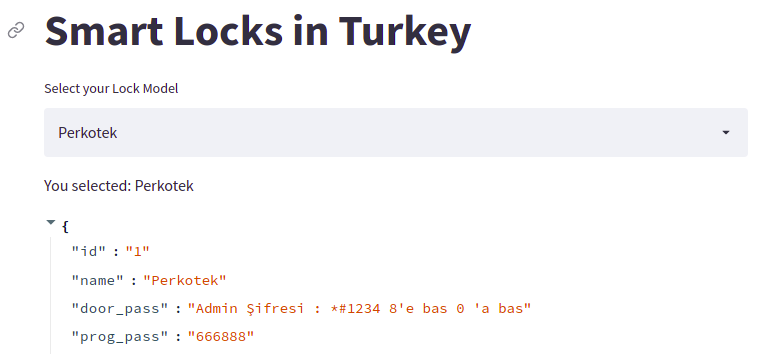

# GateCracker :robot:
 - Find default passwords on Smart Locks in Turkey
 
 [](https://python.org)

# How to run the project? :thinking:
 - Clone github repository in your local system  `git clone https://github.com/aydinnyunus/gateCracker.git`
 - Move in gateCracker repository  `cd gateCracker`
 - Create new virtual python environment  `python3 -m venv venv`
 - Activate virtual python environment  `source venv/bin/activate`
 - Install all the libraries mentioned in [requirements.txt](https://github.com/aydinnyunus/gateCracker/blob/master/requirements.txt) using  `pip install -r requirements.txt`
 - Run Python file  `python main.py`
 
# Directory Tree :cactus:
```bash
.
├── images
│   ├── website.png
├── README.md
├── requirements.txt
└── main.py

2 directories, 16 files
```
 
## ScreenShot :camera_flash:

https://share.streamlit.io/actuallytest/test2/main/main.py

**1).** This is the Main Page of the website. Select your model on the Select Box Menu. <br><br>



## Blog Post

https://sockpuppets.medium.com/bypassing-door-passwords-4004b8d7995

## Bug / Feature Request :man_technologist:
If you find a bug (the application couldn't handle the query and / or gave undesired results), kindly open an issue [here](https://github.com/aydinnyunus/gateCracker/issues/new) by including your search query and the expected result.

If you'd like to request a new function, feel free to do so by opening an issue [here](https://github.com/aydinnyunus/gateCracker/issues/new). Please include sample queries and their corresponding results.

It is my first application with GUI.Thank you !.

## Connect with me! 🌐

[](https://linkedin.com/in/yunus-ayd%C4%B1n-b9b01a18a/)       [](https://github.com/aydinnyunus/gateCracker)     [](https://instagram.com/aydinyunus_/) [](https://twitter.com/aydinnyunuss)


